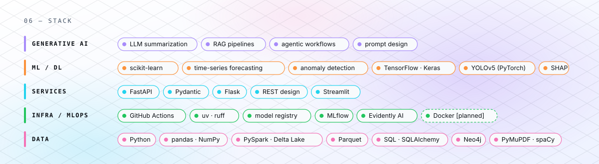
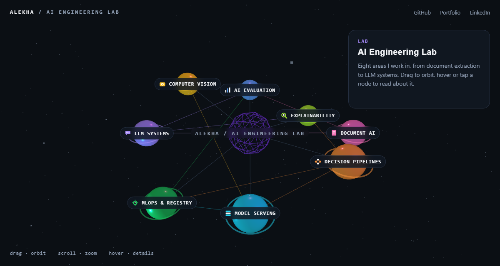

<picture>
  <source media="(prefers-color-scheme: dark)" srcset="assets/hero-dark.svg">
  
</picture>

  <a href="https://alekha1234.github.io/alekha1234/"><b>Interactive 3D lab</b></a>&nbsp;&nbsp;·&nbsp;&nbsp;
  <a href="https://alekha1234.github.io/gujurialekha.github.io/">Portfolio</a>&nbsp;&nbsp;·&nbsp;&nbsp;
  <a href="https://www.linkedin.com/in/gujuri-alekha/">LinkedIn</a>&nbsp;&nbsp;·&nbsp;&nbsp;
  <a href="https://alekha1234.github.io/gujurialekha.github.io/my_documents/resume/gujuri_alekha_resume.pdf">Resume</a>&nbsp;&nbsp;·&nbsp;&nbsp;
  <a href="mailto:gujurialekha@gmail.com">Email</a>&nbsp;&nbsp;·&nbsp;&nbsp;
  <a href="https://www.kaggle.com/gujurialekha">Kaggle</a>

I take machine-learning models from a rough problem statement to a service someone else can call, and stay with them through integration, release and whatever breaks afterwards.

Associate Data Scientist at Trinity Mobility (Bengaluru), working on smart-city ML: forecasting and decision pipelines, FastAPI inference services, a model registry with single-click CI/CD, and LLM-generated summaries that let command-centre operators read *why* an alert fired instead of raw model output. Completing an MCA in Machine Learning & AI alongside.

 

## `01` — What I build

<picture>
  <source media="(prefers-color-scheme: dark)" srcset="assets/system-map-dark.svg">
  
</picture>

Everything I work on has the same shape: **data in → model → service → someone acts on the output.** What differs is which stage is the hard part.

- A three-stage irrigation decision pipeline — forecast conditions, decide whether to irrigate, predict for how long — behind one FastAPI call.
- A no-code ML platform: SQL / API / file ingestion, visual feature engineering, model training with built-in validation, a model registry, MLflow tracking, Evidently drift checks and coverage-gated single-click CI/CD.
- RAG and agentic LLM workflows that turn model alerts into grounded, plain-language summaries for command-centre operators; SHAP for explainability.
- A section-aware document-extraction library with CI and releases; a modular scikit-learn pipeline with a Flask front end; computer-vision fine-tuning experiments; classical-NLP reference notebooks.

No accuracy, latency or throughput numbers appear on this page until an evaluation harness produces them.

 

## `02` — Now

`[FUTURE PROJECT]` **docparse** — growing [resume-parser](https://github.com/alekha1234/resume-parser) into an intelligent document-processing service: a FastAPI `/parse` endpoint, rule-based and LLM extractors behind one schema, a field-level evaluation harness on synthetic fixtures, and a Docker image.
First milestone: labelled fixtures + evaluation script. Progress will be visible in the repository, not claimed here.

 

## `03` — Flagship

### [resume-parser](https://github.com/alekha1234/resume-parser)

Section-aware extraction of structured data from resumes (PDF, DOCX, TXT): contact, education, experience, projects, skills, certifications — into typed records and a SQLite store, with a Streamlit UI for upload and search.

| | |
|---|---|
| **Problem** | Resumes are free-form. Every ATS, recruiter tool and HR dataset starts with the same unglamorous step: turning them into fields you can query. |
| **Approach** | PyMuPDF text extraction → section detection → one extractor per section (regex + spaCy heuristics for experience, projects, education, contact) → dataclass schema → SQLAlchemy store. |
| **Stack** | Python 3.12 · PyMuPDF · spaCy · SQLAlchemy · Streamlit · uv · ruff · GitHub Actions |
| **Engineering** | Packaged library (`pyproject.toml` + lockfile), lint gate on the development branch, auto-tagged release on every push to main, PR-based workflow. |
| **Status** | v1.0 — library + UI. Next: `/parse` API, LLM extractor, evaluation harness, Docker. Accuracy: not yet measured — the harness comes first. |

 

## `04` — Selected work

**[End-to-End-Machine-Learning-Project](https://github.com/alekha1234/End-to-End-Machine-Learning-Project)** · ML pipeline + Flask
Problem: most notebooks never become software. Approach: separate components for ingestion → transformation (`ColumnTransformer` pipeline) → a trainer that benchmarks six regressors (Random Forest, Gradient Boosting, XGBoost, AdaBoost, Decision Tree, Linear), plus a prediction pipeline and a Flask form that calls it. Decision: each stage is a class with a config dataclass so stages can be swapped without touching the app. Custom logger and exception modules. *Stack: scikit-learn · XGBoost · Flask · pandas.*

**[Face-Mask-Detection-Using-YoloV5-Model](https://github.com/alekha1234/Face-Mask-Detection-Using-YoloV5-Model)** · object detection
Fine-tuning YOLOv5 on an annotated face-mask dataset for mask / no-mask localisation. Covers dataset preparation, training configuration and inference on images. Result: `[NEEDS INPUT — mAP from the notebook's final run]`. *Stack: YOLOv5 (PyTorch) · OpenCV.*

**[Computer-Vision-Object-Detection](https://github.com/alekha1234/Computer-Vision-Object-Detection)** · classification lab
Three image classifiers: ResNet50 transfer learning (cat vs dog), a CNN for marine jellyfish species, and a CIFAR-10 baseline. Useful as a comparison of transfer learning vs training from scratch on small datasets. *Stack: TensorFlow · Keras.*

**[Natural-Language-Processing](https://github.com/alekha1234/Natural-Language-Processing)** · text foundations
Step-by-step notebooks for text cleaning, one-hot, bag-of-words, TF-IDF and n-grams — the pre-transformer baseline I still reach for first on tabular text. *Stack: NLTK · scikit-learn.*

**Smart Irrigation — 3-stage ML pipeline & command-centre integration** · Trinity Mobility
Forecast soil and weather conditions → classify whether irrigation should run → regress its duration, each stage feeding the next; integrated into a FastAPI service with AI-generated alert summaries for operators. *Stack: Python · FastAPI · scikit-learn · pandas · PySpark · Delta Lake.*

**ML Composer — no-code machine-learning platform** · Trinity Mobility
Lets people without an ML background ingest data from SQL, big-data platforms, APIs and files, explore and transform it visually, train regression / classification / clustering models, and judge them with built-in evaluation before anything reaches production. Model registry, MLflow, Evidently AI, coverage-gated single-click CI/CD. *Stack: Python · Flask · FastAPI · scikit-learn · PySpark · MLflow · Evidently AI.*

**Smart Energy — grid simulation engine & synthetic telemetry** · Trinity Mobility
Physics-informed synthetic generation of load curves, peak events and anomalies at 15-minute, hourly and daily resolution for training and validating demand-response and fault-detection models. *Stack: Python · Pandapower · NetworkX · NumPy · Parquet.*

 

## `05` — AI Engineering Lab

<picture>
  <source media="(prefers-color-scheme: dark)" srcset="assets/lab-dark.svg">
  
</picture>

Text version

| # | Area | What it means in practice |
|---|---|---|
| 01 | Document AI | section-aware extraction from resumes → typed records |
| 02 | Decision pipelines | forecast → decide → duration, returned by one API call |
| 03 | Model serving | FastAPI + Pydantic inference services; Flask / Streamlit demos |
| 04 | MLOps & registry | model registry, MLflow, Evidently drift, single-click CI/CD |
| 05 | LLM systems | alert summarization, RAG, agentic workflows for operators |
| 06 | Computer vision | YOLOv5 fine-tuning, ResNet50 transfer, CNN classifiers |
| 07 | AI evaluation | field-level evaluation harness for document extraction (planned) |
| 08 | Explainability | SHAP + feature importance on production models |

 

## `06` — Stack

<picture>
  <source media="(prefers-color-scheme: dark)" srcset="assets/stack-dark.svg">
  
</picture>

Text version

- **Generative AI** — LLM summarization · RAG pipelines · agentic workflows · prompt design
- **ML / DL** — scikit-learn · time-series forecasting · anomaly detection · TensorFlow / Keras · YOLOv5 (PyTorch) · SHAP
- **Services** — FastAPI · Pydantic · Flask · REST design · Streamlit
- **Infra / MLOps** — GitHub Actions · uv · ruff · model registry · MLflow · Evidently AI · Docker *(planned)*
- **Data** — Python · pandas · NumPy · PySpark · Delta Lake · Parquet · SQL / SQLAlchemy · Neo4j · PyMuPDF · spaCy

 

## `07` — Interactive lab

**[Open the 3D lab →](https://alekha1234.github.io/alekha1234/)** — the eight areas above as an orbitable 3D graph. Drag to rotate, hover or tap a node for what it is, what it runs on, and where the code lives.

What you can check on this GitHub today, without opening a notebook:

- **CI with a release path** — resume-parser: dependency sync and lint on the development branch, automatic version tag + release on main.
- **Packaging** — `pyproject.toml` + lockfile, `src/` layout, tagged releases.
- **Modular pipeline** — End-to-End-Machine-Learning-Project: ingestion, transformation, trainer and prediction pipeline as separate components with config dataclasses, logging and custom exceptions.
- **Serving** — a Flask prediction endpoint and a Streamlit app.

What I'm adding publicly, in this order: **tests → evaluation harness → FastAPI service → Docker image.** Latency, throughput and accuracy figures will appear here once they come out of that harness, not before.

 

## `08` — Find me

[Portfolio](https://alekha1234.github.io/gujurialekha.github.io/) · [LinkedIn](https://www.linkedin.com/in/gujuri-alekha/) · [Resume](https://alekha1234.github.io/gujurialekha.github.io/my_documents/resume/gujuri_alekha_resume.pdf) · [gujurialekha@gmail.com](mailto:gujurialekha@gmail.com) · [Kaggle](https://www.kaggle.com/gujurialekha) · Bengaluru, India

MCA, Machine Learning & AI — Lovely Professional University (2025–2027) · B.Sc. Physics — Science Degree College, Kukudakhandi (2018–2021) 
Certified Data Scientist — IABAC (2023) · Certified Data Scientist — NASSCOM FutureSkills Prime / MeitY (2023) · Data Science Immersive — DataMites (2023)
